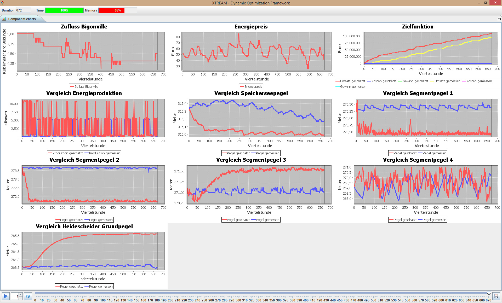

# Smart System IDE

**Integrated Development Environment (IDE) for Smart Systems.**

The tool covers the following features:

* Modeling of objective functions and constraints.
* Modeling of behavioral choices in different systems states.
* Automatic search for optimal behaviors in the behavior space.
* Composable visualization of the system state and the search space.

Here is a screenshot of the tool applied to a hydro power plant case.

